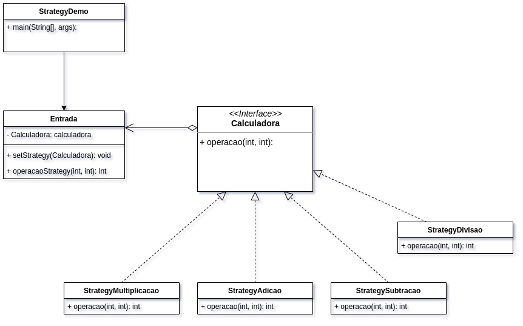

# Métodos Avançados de Programação

## UNIESP Faculdades

### Professora

* Drª Alana Morais ([alanamm.prof@gmail.com](mailto:alanamm.prof@gmail.com))

### Aluno

* Mário Sergio Ribeiro Nunes ([mariosergio3108@gmail.com](mailto:mariosergio3108@gmail.com))

### Padrão Comportamental: 
Strategy
Também conhecido como: Estratégia

## Padrão Strategy

### Problema: 

Suponhamos que você queira implementar uma aplicação onde uma única classe tenha que executar a mesma entrada de dados de várias maneiras diferentes, neste exemplo, sugerimos o desenvolvimento de uma calculadora, onde inicialmente a mesma irá executar apenas 4 operações (soma, subtração, divisão e multiplicação), tudo isso centralizado em uma única classe que irá executar a entrada de dados de maneiras diferentes. Porém, com o passar das versões da aplicação, foi sugerido incrementar novas operações e regras da matemática, cada vez que você adicionava um novo algoritmo de cálculo, a classe principal da calculadora dobrava de tamanho. Em determinado momento, o monstro se tornou algo muito difícil de se manter.

Qualquer mudança a um dos algoritmos, seja uma simples correção de bug ou um pequeno ajuste no valor das operações, afetava toda a classe, aumentando a chance de criar um erro no código já existente.

### Solução: 

O padrão Strategy sugere que você pegue uma classe que faz algo específico em diversas maneiras diferentes e extraia todos esses algoritmos para classes separadas chamadas estratégias.

A classe original, chamada Contexto, deve ter um campo para armazenar uma referência para um dessas estratégias. O contexto delega o trabalho para um objeto estratégia ao invés de executá-lo por conta própria.

O contexto não é responsável por selecionar um algoritmo apropriado para o trabalho. Ao invés disso, o cliente passa a estratégia desejada para o contexto. Na verdade, o contexto não sabe muito sobre as estratégias. Ele trabalha com todas elas através de uma interface genérica, que somente expõe um único método para acionar o algoritmo encapsulado dentro da estratégia selecionada.

Desta forma o contexto se torna independente das estratégias concretas, então você pode adicionar novos algoritmos ou modificar os existentes sem modificar o código do contexto ou outras estratégias.

### Consequências: 

Se você só tem um par de algoritmos e eles raramente mudam, não há motivo real para deixar o programa mais complicado com novas classes e interfaces que vêm junto com o padrão.

### Exemplo: 

